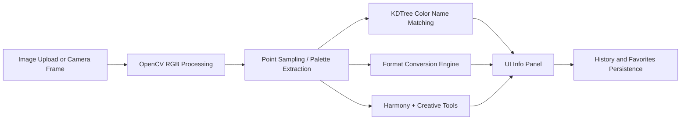

<div align="center">


<p>
  
  
  
  
</p>

<p>
  A premium desktop toolkit for fast, accurate, and fully offline color analysis.<br/>
  Detect, convert, match, mix, extract, and build color systems from images or live camera feed.
</p>

</div>

---

## Why This Project Stands Out

- Pixel-accurate click detection from uploaded images and live camera frames.
- Fast color intelligence powered by KDTree matching and K-Means palette extraction.
- Designer-ready outputs in HEX, RGB, HSV, HSL, and CMYK with one-click copy.
- Built-in harmony generation, favorites, and history for practical workflow speed.
- Smooth desktop UX with modern CustomTkinter components and theme transitions.

## Download (Windows)

Run instantly without installing Python:

[](https://github.com/Misrilal-Sah/Color-Detection-Using-python/releases/latest)

> Packaged executable is large (around 370 MB) because it bundles computer-vision and ML dependencies.

## Feature Showcase

### Detection and Analysis
- Image upload: JPG, JPEG, PNG, BMP, GIF, WebP
- Live webcam color detection and instant snapshot capture
- Click-to-detect sampling from any point in the image
- Dominant palette extraction using K-Means clustering

### Color Intelligence
- Nearest named color matching using KDTree search
- 265+ color database entries
- Full format conversion: HEX, RGB, HSV, HSL, CMYK
- Copy any code format directly to clipboard

### Creative Toolkit
- Harmony sets: complementary, triadic, analogous, split-complementary
- Interactive color mixer with blend ratio slider
- Gradient gallery with presets and custom gradient creation
- CSS gradient string generation and copy support

### Productivity and UX
- Recent color history
- Favorites management (persisted to local JSON)
- Light and dark appearance toggle with smooth transition
- Offline-first workflow with local data storage

## Quick Start

### Requirements
- Python 3.8+
- Webcam (optional, for camera mode)

### Installation

```bash
cd Color_detection
python -m venv venv
venv\Scripts\activate
pip install -r requirements.txt
python main.py
```

## How It Works



## Tech Stack

| Layer | Technology |
|---|---|
| UI | CustomTkinter |
| Image Processing | OpenCV |
| Numeric Processing | NumPy |
| ML / Search | scikit-learn (KMeans, KDTree) |
| Image Handling | Pillow |
| Packaging | PyInstaller |

## Project Structure

```text
Color_detection/
|- main.py
|- requirements.txt
|- ColorDetectionPro.spec
|- core/
|  |- color_detector.py
|  |- color_matcher.py
|  \- color_converter.py
|- ui/
|  |- app.py
|  \- components/
|- data/
|  |- colors.json
|  \- user_data.json
|- utils/
\- tests/
```

## Usage Flow

1. Launch the app and choose Upload Image or Camera Capture.
2. Click any pixel to detect and identify color details.
3. Review color name confidence and all format conversions.
4. Extract dominant palette or explore harmonies.
5. Save key colors to Favorites for later reuse.

## Roadmap Ideas

- Batch image processing mode
- Exportable palette formats (ASE, GPL, JSON)
- Enhanced accessibility panel (contrast pair testing)
- Plugin-style color datasets

## Contributing

Contributions, ideas, and improvements are welcome.

1. Fork the repository
2. Create a feature branch
3. Commit your changes
4. Open a pull request

---

<div align="center">
  
  <p><strong>Crafted for Designers and Developers</strong></p>
  <p>Fast • Offline • Aesthetic • Practical</p>
  <p>
    <a href="https://github.com/Misrilal-Sah/Color-Detection-Using-python/releases/latest">Download</a>
    •
    <a href="https://github.com/Misrilal-Sah/Color-Detection-Using-python/issues">Issues</a>
    •
    <a href="https://github.com/Misrilal-Sah/Color-Detection-Using-python">Star the Project</a>
  </p>
</div>
